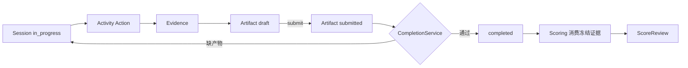

# 15 — 训练协约：Workflow / Activity / CaseRevision / Context

> 状态：实现基线/历史决策（2026-09-25）；**不是 2.0 后续路线图**。
> 当前 2.0 目标、技术栈取舍、减法原则与里程碑以 [`docs/16`](16-v2-maintainable-monolith-objectives.md) 为准。
> 本文件保留已落地的 Workflow/Activity、CaseRevision、成员、受众与上下文边界；与 16 冲突时，以 16 的“少抽象、可维护单体”约束为准。
> 依据：代码逐条核验、子代理交叉复核与外部架构评审。
> 一句话：**保留严格训练内核，但不把它继续扩展成通用插件平台。**

---

## 一、为什么不叫「插件系统」

产品层继续叫插件，工程层不引入动态加载、独立包、版本协商、依赖解析、插件市场或运行时卸载。理由：

1. 维护者少、AI 改动频率高，插件基础设施自身会变成最贵的维护对象。
2. 当前系统的问题不是「抽象不够」，而是**同一条事实有多个真相源**：前端 `registry.ts` 决定有哪些工具、`case_data.tools.*` 决定能力开关、`capabilities.gen.ts` 决定前端可见能力、后端 `TOOL_BINDINGS` 决定后端分发、病例数据决定实际可用性。四套口径无法对齐，于是出现 `nursing_diagnosis` 后端有实现却**无任何病例声明**、前端有面板却永不可达（`backend/modules/training/capabilities.py:58-63`、`frontend/src/components/training/tools/registry.ts:27`、`backend/data/cases/*.json`）。
3. 需要的不是安装机制，而是**受限扩展模型 + 一个服务端解析出的 manifest**。

版本化的正确落点是 **CaseRevision、prompt/invocation snapshot、评分规则引用**，不是 `physical_exam@2.1.3`。

---

## 二、Workflow Plugin

一个 Workflow = 一条完整训练闭包。至少二期：

- `history_taking`：对话 + 床旁检查 + 护理评估
- `clinical_reasoning`：回合 + 检查点 + 会诊 + 诊断（现有 `/api/simulations` 内核）

### 必须声明

```python
@dataclass(frozen=True)
class WorkflowPlugin:
    id: str                      # "history_taking" | "clinical_reasoning"
    label: str
    description: str
    entry_modes: list[str]       # 可用入口形态：自由练习 / 作业 / 考核
    activities: list[str]        # 允许挂载的 Activity id（白名单，不是无限扩展点）
    session_state_machine: ...   # 状态 + 合法迁移（唯一 owner）
    completion_policy: CompletionPolicy   # 需要哪些产物才算完成；是否要求评估已提交
    artifact_kinds: list[str]    # 产出哪些学生产物
    scoring_profile: str         # 评分策略引用（rubric + prompt + 评分器）
    context_profile: str         # 患者/学生/证据三段上下文装配引用
    ui: WorkflowUI               # 入口与工作区：路由、壳布局、导航项
    admin: WorkflowAdmin         # 教师侧：病例 schema、作业配置项、复核视图
```

### 禁止声明

- 禁止把「某个具体病例的逻辑」写进 Workflow（病例是数据，不是代码分支）。
- 禁止 Workflow 直接持有 LLM prompt 文本；只能引用 `context_profile` / `scoring_profile`。
- 禁止恢复 `training_type` 这种「单字段总分派」——类型不是字符串，是 manifest。

---

## 三、Activity Plugin

一个 Activity = 一个受控可执行能力，嵌入某 Workflow。

### 必须声明

```python
@dataclass(frozen=True)
class ActivityPlugin:
    id: str                      # "physical_exam" | "nursing_assessment" | "quiz" | "consult"
    label: str
    inputs_schema: type          # 请求 schema（强类型，pydantic）
    outputs_schema: type         # 结果 schema
    availability: Availability   # 何时可用：session 状态、是否已有提交、病例是否配置
    handler: Callable            # 领域行为（确定性优先）
    ui_renderer: str             # 前端渲染组件 id（由 manifest 映射，不靠前端自造注册表）
    evidence_kind: str | None    # 产出的证据类型（进评分）
    artifact_kind: str | None    # 产出的学生产物类型
    context_contribution: list[ContextContribution]   # 可注入的声明式片段
```

### 禁止声明

- **禁止 Activity 声明 workflow 状态迁移、完成训练、总评分、组织权限。** 这些属于 Workflow 与内核。
- **禁止 Activity 自建前端能力开关（FE-only capability）。** 可用性一律由服务端 resolved manifest 下发。
- **禁止 Activity 直接拼接 system prompt**，只能贡献类型化数据（见 §八）。
- 禁止 Activity 把结果只写进 `runtime_state` 而不产生 evidence/artifact（现在 Quiz 与护理诊断就是这样：`backend/modules/training/tools/quiz.py:64-78`、`nursing_diagnosis.py:83-102`）。

---

## 四、Resolved Manifest（单一真相源）

服务端解析一份 manifest，前端只消费、不推断：

```json
{
  "workflow": {"id": "history_taking", "label": "病史采集"},
  "session": {"id": 123, "revision": 12, "status": "in_progress"},
  "activities": [
    {"id": "physical_exam", "label": "床旁检查", "available": true,
     "commands": ["perform_exam"], "ui_renderer": "PhysicalExamPanel"},
    {"id": "nursing_assessment", "label": "护理评估",
     "available": true, "state": {"draft": true, "submitted": false},
     "ui_renderer": "NursingAssessmentPanel"}
  ],
  "completion": {"required": ["nursing_assessment.submitted"], "can_complete": false,
                 "blockers": ["护理评估尚未提交"]},
  "student_view": {"patient": {...}, "disclosed_facts": [], "completed_actions": []}
}
```

规则：

- 解析输入 = Workflow 白名单 ∩ 病例配置 ∩ 作业覆盖 ∩ 组织授权。
- **病例声明了内核不认识的 activity → 发布时报错**，不允许「配置了但不可达」这种静默状态（当前正是这样）。
- manifest 由 `/api/workflows`（目录）与 `/api/training/{id}/session`（实例）暴露，前端 TS 类型由 `pnpm run api:update` 生成。
- 删除 `getProfiles` / `queryKeys.profiles` / `TRAINING_TYPE_CONFIGS` / `ALL_CAPABILITIES` 三源体系（`frontend/src/api/training.ts:8`、`frontend/src/components/training/types.ts:10-21`、`frontend/src/engine/capabilities.gen.ts`）。

---

## 五、训练主轴协约

| 概念 | owner | 说明 |
|---|---|---|
| Session | Workflow | workflow id、revision counter、状态机、开始/结束时间 |
| Message | 对话层 | 只记录可回放对话；不承担工具审计 |
| Action | Activity 执行层 | `UNIQUE(session_id, request_id)`；结果不可原地改写；重复执行产生新 Action 供效率评分 |
| Artifact | 学生产物 | 护理评估、推理结论文档等；有 `draft → submitted` 生命周期 |
| Completion | 内核 CompletionService | **唯一**判断完成条件；不接受前端或 finalize 自行认定 |
| Score | 评分域 | 只消费冻结证据（符合 `docs/10 §9.1`） |

硬性规则：

1. 提交与完成是两个动作，**但在要求评估的 workflow 中必须同一事务边界**（原子 `submit_and_complete` 或 completion 校验 submitted）。
2. **禁止 finalize 把 draft 自动标为 submitted**（当前缺陷：零评估也能完成并评分，`backend/modules/training/session/finalize.py`）。
3. 评分不得读未提交草稿，也不得「猜测学生已提交」。
4. 系统终止（超时 / 患者离开）与用户主动完成必须区分原因；系统终止不伪造学生提交。



---

## 六、CaseRevision 与病例发布

结论：**`status` 与版本表组合，不二选一。**

```text
Case: id, name, description, difficulty, time_limit_minutes,
      status: draft | published | archived,
      current_revision_id, case_data(工作副本，仅教师编辑对象)
CaseRevision: id, case_id, revision_no, content(冻结的病例载荷),
      created_by, created_at, published_at
              （已发布 revision 不可修改；单一 content JSONB，不再按 Activity 切列）
```

- `status` 管产品生命周期；`CaseRevision` 管内容不可变与训练可复现。
- Assignment 与 Session **必须引用明确 revision id**（`assignments.case_revision_id` 为 NOT NULL，发布时钉住）；编辑已发布病例 = 产生新 revision，旧训练永远按旧版复盘与评分。
- `archived` 只阻止新使用，不删除历史 revision。
- 不做 Git 式分支 / merge / semver。
- 元数据（name/difficulty/time_limit）**只在 Case 列**，`case_data` 落库前剥离，不再重复保存（`schemas/case_schema.strip_case_metadata`）；已退场的 `training_type` 不在此列 —— 它没有任何列或消费端，遇到只被审计点名，不会被静默丢弃。
- 病例发布前跑质量门禁（复用 `backend/modules/cases/validator.py`，当前 CRUD 未调用）：必填字段、隐藏信息是否误入公开投影、exam anchor 完整性、rubric 维度合法、时长合法、是否残留已退场字段。
- 训练时限只允许一个口径：病例/作业声明值经校验层（越界即 422），**不得静默改写**（当前 `max(30, min(120, …))` 把教师填的 20/180 静默改成 30/120，见 `backend/modules/training/router/session.py:206-208`）。

---

## 七、组织、成员与作业受众

```text
Class: id, name, cohort_label, created_at            UNIQUE(cohort_label, name)
ClassMembership: user_id, class_id, member_role('student'|'teacher'), joined_at
                 UNIQUE(user_id, class_id)
Assignment: class_id, audience_mode('class'|'selected')
AssignmentRecipient: assignment_id, user_id          PRIMARY KEY(assignment_id, user_id)
```

- **多班级是正式能力，不是数据异常**：同一学生可属多班，同一教师可任教多班；同一用户在 A 班是 student、在 B 班是 teacher 合法。
- **不设主班级**。任何 `primary_class_id` 都会诱导后续代码「取第一条」，复刻今天的不一致；UI 直接展示集合（学习班级 / 任教班级）。
- Grade 实体删除，名称迁为 `Class.cohort_label`（保留分组与筛选能力，去掉只是父实体的壳）。
- 受众在发布时**固化为 recipient 快照**：全班模式复制当时 student membership；成员后加入不背旧作业，退出不丢已发布作业与历史。
- 统计与排名必须显式指定 cohort（class_id + assignment_id）；无作用域时返回稳定集合，禁止任意覆盖或 `.first()`。
- 教师作用域（teacher membership 决定可管理/可统计的班级）分两阶段启用：先落地数据与 UI 归属，再开启强制 —— 避免上线即锁死现有教师。

---

## 八、Context Assembly 与 Evidence

统一**装配权**，不统一领域所有权。

```text
Patient Role domain ─┐
Student Projection ──┤
Activity Contribution├─→ ContextAssembler ─→ LLMInvocation ─→ (Audit + Snapshot)
Evidence/Scoring ────┘
```

- 各域各自**生产**有类型的 contribution；Assembler 决定**选择、排序、裁剪、预算**。
- 患者扮演上下文不得进入学生响应；学生可见信息只来自 Student Projection（当前泄漏防护靠字段投影，需固化为契约而非约定）。
- Activity 只能贡献结构化结果，**不能覆盖患者身份、安全边界或评分规则**。
- prompt snapshot 由 LLM Invocation 层持久化（已有 v1/v2 reader：`backend/modules/training/pipeline/snapshot_compat.py`）；它解决「记录了什么」，Assembler 解决「谁有权注入什么」。
- 每次调用记录：模型、模板/快照版本、贡献源列表、token 分段、关联 session/action。
- 禁止任何 router / React 组件 / Activity handler 自行拼接完整 system prompt。

---

## 四·补 Manifest 的三个 projection

同一 envelope，三种投影，**不要三个互不兼容的 DTO**：

| projection | 消费者 | 关键字段 |
|---|---|---|
| `session` | 学生运行时 | workflow、case(revision_id)、session(revision/status)、`activities[].availability`、`artifacts`（draft/submitted）、`completion`（eligible + conditions + blockers）、`actions[].enabled` |
| `catalog` | 学生训练目录 | workflow label、case revision、assignment_id、due_at、attempt policy、progress summary（**不含**运行时 activity 细节） |
| `authoring` | 教师配置病例/作业 | 可挂 activity 列表与配置 schema、病例 revision、校验报告、audience 预览 |

```json
{
  "schema": "workflow-manifest",
  "projection": "session",
  "workflow": {"id": "history_taking", "label": "护理问诊", "ui": {"workspace": "patient_interaction", "primary_surface": "conversation"}},
  "case": {"case_id": 7, "revision_id": 21, "revision_no": 3},
  "session": {"session_id": 123, "status": "active", "revision": 13},
  "activities": [
    {"id": "physical_exam", "label": "床旁检查", "kind": "interaction",
     "availability": {"state": "available", "reason_code": null},
     "ui": {"renderer": "physical_exam", "placement": "side_panel", "order": 20}}
  ],
  "artifacts": {
    "nursing_assessment": {"required": true, "state": "draft", "revision": 4, "submitted_at": null}
  },
  "completion": {
    "eligible": false,
    "conditions": [{"id": "assessment_submitted", "label": "提交护理评估", "satisfied": false}],
    "blockers": [{"code": "ASSESSMENT_NOT_SUBMITTED", "message": "请先提交护理评估",
                  "target": {"type": "artifact", "id": "nursing_assessment"}}]
  },
  "actions": [{"id": "complete_session", "enabled": false, "label": "结束训练"}]
}
```

硬规则：**前端不得重新推导** availability、completion、audience、病例版本。`eligible` / `availability` 一律来自服务端。

---

## 十三、前端四层与 RendererMap 纪律

```text
Server Contract（manifest projections）
  → Query Cache（TanStack Query = 服务端状态真值）
    → Workflow Workspace（布局/导航/槽位，workflow 各自实现）
      → Activity Renderer（纯呈现 + 交互）
```

- Zustand 只保留会话瞬态（当前 tab、面板展开、输入草稿）；**不得**成为第二份 session 状态。
- `RendererMap` 保留，但必须「笨」：`renderer key → React component`，**不得**回答「这个病例有没有某能力」。
- 事件通信保留（`activity:open/close`、`workspace:focus`、toast、流式 token/delta、`session.updated`），但事件只说明「发生了什么」，收到后更新/失效 query cache，不自行持有状态。

| 删除 | 替代 |
|---|---|
| `tools/registry.ts` 的能力过滤 | `manifest.activities[]` + 纯 RendererMap |
| `useToolBridge` 通用 RPC | 类型化 activity mutation/query client |
| `sceneStore` | 服务端 session state + workflow 局部 UI state |
| `PanelContext` 作为业务状态容器 | workspace 布局状态；业务数据走 query cache |
| `capabilities.gen.ts` 及其 helpers | `activity.availability` |
| 前端 `canFinish()` / `isComplete()` | `manifest.completion` |
| `caseData → tools` 推导 | resolved manifest |
| 前端 workflow 常量 | `authoring` projection |

---

## 十四、教师工作台信息架构

围绕四个对象组织，而不是围绕「后台功能」：

```text
班级 → 作业 → 训练证据 → 病例
```

任何统计数字必须能一路点进 Session / Artifact / Action 证据：`Dashboard 指标 → 过滤后的作业/训练列表 → 学生 session → Artifact/Action → Evidence → 评分依据`。**禁止无法解释来源的「平均表现 82%」卡片。**

| 页面 | 主要操作 |
|---|---|
| 教师首页 | 我的班级、进行中作业、待复核、近期异常（可下钻） |
| 班级列表 | 创建/归档班级、按 `cohort_label` 筛选 |
| 班级详情·花名册 | 搜索成员、批量添加/移除、导入、student/teacher membership、查看成员其他班级归属 |
| 班级详情·作业 | 该班历史/进行中作业、完成率、进入学生明细 |
| 作业列表 | 按班级/workflow/状态筛选、复制 |
| 作业创建 | workflow → 病例 revision → 全班/指定学生 → **recipient 预览** → 发布 |
| 作业详情 | recipient 快照、未开始/进行中/完成/待复核、分数统计、逐学生下钻 |
| 复核队列 | 按作业/病例/班级过滤；打开 Artifact + Evidence + 评分明细 |
| 病例库 / 编辑器 / 版本 | draft/published/archived、revision diff、引用关系、发布校验报告、resolved manifest 预览 |
| 训练详情 | 完整时间线：message / action / artifact / submission / completion / score |
| 学生详情 | memberships、各班作业表现（统计范围必须显式选择） |

受众发布交互：「指定学生」不做巨大 checkbox 表，而是**受众规则 → 搜索/筛选 → 当前选择 → 发布前快照预览**（例：将发布给 38 名学生：护理 23-1 班全班 35 人 + 指定 3 人）。发布后受众固定，班级后续增删成员不影响该作业。

---

## 十五、三个最容易再次分裂成两套真相源的陷阱

1. **RendererMap 偷偷变回能力注册表**（`renderer exists → capability exists`）。防线：RendererMap 只接受 `ui.renderer`；lint 禁止 renderer 层读 `case_data`/`capabilities`/`workflowId` 判断可用性；CI 对所有 published 病例调用 manifest 端点，断言每个 `ui.renderer` 在前端构建产物中存在（反向不要求）。
2. **前端再算完成条件**（`canFinish()`），随后与后端 completion 漂移。防线：completion 只能来自 manifest；前端只渲染 `blockers[].message` 与 `target`。
3. **病例元数据再度双源**（JSON 编辑器写 `case_data.difficulty/time_limit`，列另有权威值）。防线：`case_data` 落库前剥离元数据键（读取路径已统一到列，见本次改动）；schema 校验拒绝越界声明而不是静默改写。

## 九、现有实现迁移映射

| 现有 | 目标 | 关键位置 |
|---|---|---|
| 单例 `PROFILE` | 拆为 `history_taking` Workflow 的 prompts/rubric/note_sources | `backend/modules/training/profile.py` |
| `/api/profiles` + `getProfiles` | 删除，改 `/api/workflows` 目录 + manifest | `backend/modules/admin/profiles.py`、`frontend/src/api/training.ts:8` |
| `training_type` 三处落库 + 三处死过滤 | 删除字段与参数；workflow 由路由/manifest 决定 | `models/case.py:21`、`models/training.py:57`、`cases/service.py:88-95`、`session_views.py:81,103` |
| `capabilities.py` + `capabilities.gen.ts` | 删除生成链，改 workflow/activity manifest 生成 | `backend/scripts/gen_capabilities_ts.py` |
| `tools/registry.py` 字符串分发 | Activity command 显式契约 | `backend/modules/training/tools/registry.py`、`service.py:25-34` |
| `physical_exam` handler | `physical_exam` Activity（保留确定性规则与体温/情绪行为） | `tools/physical_exam.py`、`physical_exam_rules.py` |
| `NursingRecord` 工具 | `nursing_assessment` Activity + 正式 Artifact（draft/submitted） | `tools/nursing_record.py`、`models/training.py` |
| `nursing_diagnosis` 独立工具 | 并入护理评估的结构化字段后删除 | `tools/nursing_diagnosis.py`、`NursingDiagnosisTool.tsx` |
| `quiz` 床旁工具 | `quiz` Activity，可挂训练前/后阶段；补恢复/evidence/completion 后才允许挂载 | `tools/quiz.py`、`QuizTool.tsx`、`data/cases/diabetes_foot_quiz.json` |
| `/api/simulations` 独立子系统 | `clinical_reasoning` Workflow，共享 Session/Assignment/Artifact/Score/教师查询 | `backend/modules/simulations/**`、`frontend/src/simulations/**` |
| 前端 `registry.ts` + `MessageBus` RPC | manifest 驱动的工作区 + 明确 command hook | `frontend/src/components/training/tools/registry.ts`、`engine/TrainingTool.ts`、`hooks/useToolBridge.ts` |
| 演示路由 `/showcase`、`/face-demo` | 退出生产入口（保留为开发环境或独立部署） | `frontend/src/App.tsx` |
| 空源 video presenter | 不注册进激活链，直到有真实媒体 manifest | `frontend/src/components/training/presentation/` |

---

## 十、插件准入质量门槛（DoD）

一个能力只有同时满足下列全部条件，才允许以 Activity 形态挂载到生产 workflow：

1. **入口**：学生/教师能真实到达，导航与 manifest 一致。
2. **状态**：有明确的可用/不可用条件，且由服务端下发。
3. **命令**：请求/响应强类型，幂等键与并发语义明确。
4. **持久化**：结果落正式产物（Action / Artifact），不只写 `runtime_state`。
5. **完成条件**：声明它如何影响 completion（可否阻塞完成）。
6. **证据**：能被评分引用；无证据的能力不得声称参与评分。
7. **复盘**：学生与教师能看到它的结果与依据。
8. **病例配置**：至少一个真实病例启用它（否则视为未验证能力，不进入生产 manifest）。
9. **测试**：后端行为测试 + 前端装配层测试。

---

## 十·补 `clinical_reasoning` 作为第二 workflow 的补齐清单

现状（已核验）：它是一套**真实产品内核**——确定性回合状态机、检查点/预算、会诊、
诊断点评、SUCCESS/FAILURE 结局判定、会话持久化（`modules/simulations/**`，4 个硬编码病例），
但**绕过了训练公共骨架**：没有训练目录入口、没有作业、没有产物、没有评分、没有复盘、
没有教师管理，且此前无并发保护（本次已补 `expected_revision` + `idem_key`）。

它要补齐的是**外围**，不是状态机本身：

| 维度 | 要求 | 现状 |
|---|---|---|
| 入口 | 训练目录（catalog 投影）列出该 workflow；受保护路由 `/workflows/clinical_reasoning/sessions/{id}`；导航可达 | 无（`/simulation` 是公共路由且注释谎称免登录） |
| 病例 | 转入 `CaseRevision`（workflow-specific schema；`authoring` 投影给出可配置项与校验），教师可发布/归档；4 个硬编码病例迁为内置 revision | **作者面已完成**（Slice 1）：`clinical_reasoning` 病例有类型化 schema + 发布门禁（可达性/引用完整性/锚点覆盖）+ 目录 label；4 个硬编码病例仍留在 `simulations/case.py`，待 Slice 2 迁为内置 revision |
| 作业 | 复用 `Assignment` + `AssignmentRecipient` 受众快照（不新建第二套发布体系） | 无 |
| 产物 | 推理结论（诊断 + 关键动作 + 结局）作为 `submitted` artifact，进入 completion | 无（仅会话状态） |
| 评分 | 独立 rubric：证据来自 `action_log` + 诊断 + 结局；不共享护理评分维度 | 无 |
| 复盘 | 时间线 + 结局 + 证据链接；学生可见 | 控制台内部记录 |
| 教师 | 会话列表、产物/分数查看、复核入口 | 无 |
| 上下文 | 复用 `ContextAssembler` 与 Invocation Audit；**不共享**患者对话上下文 builder | 自有 prompts，无统一审计 |

边界：**共享** Session 身份、CaseRevision、Assignment/受众、Artifact/Evidence、Score/复核、教师查询框架；**不共享**状态机与 Activity 集。第三个 workflow 出现时不应再复制一次外围。

## 十一、实施切片与验收

顺序（业务价值优先，避免长期双栈）：

1. **训练闭环修复** — Assessment draft/submitted、CompletionService、评分只读已提交版本、删除隐式提交。验收：零评估不能完成要求评估的训练；草稿永不进入正式评分。
2. **组织与作业闭环** — Membership 多班级 + 受众快照 + 约束。验收：一个学生属两班时各处结论一致，不存在 `first()` 猜班级。
3. **病例发布生命周期** — status + CaseRevision + 元数据单源 + 时限单口径 + 发布门禁。验收：病例发布后修改不改变既有训练、复盘与评分输入；archived 不破坏历史。
4. **Workflow/Activity 一次切换** — 删除旧 capability/getTools 三源体系，manifest 驱动 API 与 UI；迁移 physical_exam / nursing_assessment / quiz / nursing_diagnosis。验收：不存在「后端有实现但 UI/病例不可达」；非法配置发布即失败。
5. **Context 与第二 Workflow** — ContextContribution / Evidence / Invocation Audit 统一后，把 clinical_reasoning 正式接入共享骨架。验收：推理 workflow 从教师发布到学生训练、评分、复盘全程可达；重复请求不重复推进回合。

1→2→3 各自独立产生用户价值；4 一次斩断旧栈；5 才让第二 workflow 生产化。**不允许「新协约」与「旧 capability」并行数月。**

### 切片 4/5 的落地顺序（外部评审后收敛）

原则：**建新契约 → 离线迁数据 → 同一切换 PR 改消费者 → 删旧链 → 历史收尾**。不用 feature flag、不用运行时 fallback；旧实现只能以 transport adapter 形态存活，且不得是第二条生产读取路径。

| 步 | 改什么 | 结束时状态 | 验收 |
|---|---|---|---|
| 1 | 建 `ActivityDefinition` / 唯一 `ACTIVITY_BINDINGS`；旧 `tools/registry.py` 仍生产分发但指向**同一批 handler** | 行为不变，新契约可测试 | activity id 唯一；binding 集合与允许 id 集合一致 |
| 2 | 写一次性转换器 `scripts/migrate_case_activities.py --check/--write`（`tools.X → activities.X.config`；`exam_anchors → activities.physical_exam.config`）—— 已在换轨完成后删除，映射现在只作为冻结副本留在数据迁移 `e6b2c3d4e5f6` 里 | 生产零变化，11 病例可验证无损转换 | 11/11 可转换；quiz=1；`nursing_diagnosis`=0；语义等价 |
| 3 | `--write` 迁病例 + 解析器只读 `activities`；删 `capabilities.py` 的病例派生职责；`session_views` 返回 resolved manifest | 后端只有 Activity 一个真相源；旧前端经 transport 仍可用 | 11 病例全部 resolve；`grep '"tools"' data/cases` 无命中 |
| 4 | manifest 进 OpenAPI；建立**纯 RendererMap**（`ui.renderer → 组件`） | 前端可渲染但未切工作区 | 生成物同步；lint 禁止 renderer 读 `capabilities.gen.ts` |
| 5 | **同 PR 切工作区**：`manifest.activities → ui.renderer → RendererMap`；删 `registry.ts` / `getTools` / `capabilities.gen.ts` / 生成步骤 | 前后端均只有 Activity 真相源 | `rg -e capabilities.gen -e getTools -e tools/registry frontend/src` 零命中；E2E 覆盖评估 draft/submitted、唯一 quiz 病例、无 quiz 病例、completion blocker |
| 6 | 删后端 `capabilities.py`、旧 TOOL_BINDINGS、字符串 dispatcher 与兼容端点；router 直调 Activity | 旧链彻底退场 | 全量测试 + 病例审计通过 |

最容易踩的兼容坑（按概率）：① 前端 registry 变成第二真相源；② 病例 `tools.*` 迁移丢语义（尤其 `exam_anchors`）；③ 生成物未同步就合并；④ 旧 transport 端点被新代码继续读 `case.tools`；⑤ 把 `nursing_diagnosis` 因 handler 存在而"顺手"接进病例。

### 实施进度（分支 `feat/v2-product-convergence`，2026-09-25）

> 各切片的前端收尾（管理员病例面：状态/发布/归档/校验报告）已单独派发；浏览器验收在每个切片落地后重跑。

| 切片 | 状态 | 已落地内容 |
|---|---|---|
| 1 训练闭环修复 | **已完成（护理诊断产物化仍未完成）** | 护理评估 `draft → submitted` 生命周期（提交冻结、幂等、显式 `reopen`）；`finalize` 不再自动补提交；要求评估的 workflow 未提交即拒绝完成（`NursingAssessmentRequiredError`，且在 `acquire_scoring` 之前，不留占位）；评分只读 `submitted_at` 非空的冻结版本；终端原因区分 `user_end`/`timeout`/`patient_walkout`。护理诊断目前仍由独立 Activity 写入 `runtime_state`，尚未并入正式评估 Artifact，故不应标记为已完成。|
| 2 组织与作业闭环 | **已完成（后端 + 管理端 UI）** | `ClassMembership`（`member_role` + `UNIQUE(user_id,class_id)`）正式多班级；`Class.cohort_label`（Grade 退场）；`Assignment.audience_mode` + `AssignmentRecipient` 受众快照；`/auth/me` 与用户 API 返回 memberships 数组；班级详情 GET 补齐；成员批量增删；班级/排名/花名册统一按 `member_role='student'`；班级名取值确定性（有作用域用该班，无作用域取最小 `class_id`）；真实 Firefox + Postgres 隔离库验证多班归属、学生/教师口径分离及筛选后完整班级标签。|
| 3 病例生命周期 | **已完成（后端 + 管理端 UI）** | `cases.status`(draft/published/archived) + `case_revisions`(不可变) + `cases.current_revision_id`；`training_records`/`assignments.case_revision_id` 钉住版本；`case_data` 剥离 `name/difficulty/time_limit`（列成为唯一存储）；新端点 `GET /cases/{id}/validation`、`POST /publish`(error→422 + 字段级报告)、`POST /archive`、`GET /revisions`；`/cases` 学生目录只返回 `published && is_open`；`training_type` 三个接口字段与查询参数一并退场；迁移链 `b2c4d6e8f0a2 → e5a1b2c3d4f5 → e6b2c3d4e5f6 → e7c3d4e5f6a7`（含 data 回填与逐行报出的归档结论，downgrade 实测可逆）|
| 4 Workflow/Activity 切换 | **steps 1–5 已完成；step 6 部分完成** | 后端：`activities.py`/`manifest.py`/`features.py`，`capabilities.py` 与 `gen_capabilities_ts.py` 删除，11 病例迁到 `activities.*`；前端：**一次切换**到 manifest 驱动工作区（纯 RendererMap + `ActivityRail`(桌面)/`ActivityBar`+Bottomsheet(移动) + `CompletionStrip`/`CompletionChecklist`），`registry.ts`/`getTools`/`capabilities.gen.ts`/`SceneRenderer`/`SceneToolbar`/`TrainingTool.ts`/`sceneStore`/`getProfiles` 全部删除，`package.json` 生成链移除 `cap:generate`；`/api/profiles` 端点删除（**step 6 剩余**：旧 `/tools` transport adapter 与字符串 dispatch 待新命令端点落地后移除）|
| 5 Context 与对话可靠性 | **基础设施已落地；Invocation Audit 与第二 workflow 待做** | `ContextFragment`/`ContextAssembler` 统一选择、排序、裁剪、预算与槽位边界；对话回合采用事务 A（学生消息 + `pending` turn）/事务 B（患者回复 + 收尾）两阶段持久化；`request_id` 幂等、失败可审计、流式异常兜底、身份/隐藏主题守卫类型化追加；新增耐久性与装配测试覆盖。尚未接入 Invocation Audit/Evidence 的完整公共骨架；`clinical_reasoning` 的作者面（病例 schema/发布门禁/目录 label）已由 5.1 落地，学生工作区、作业、Artifact、评分与复盘仍待做。|
| 5.0 Workflow 判别契约（临床推理 Slice 0） | **已完成** | 新增唯一 workflow 注册表/解析器 `modules/training/workflows.py`（当时只登记 `history_taking`）；`training_records.workflow_id`（NOT NULL，DDL `a9d0c1b2e3f4`，存量行回填 `history_taking`）成为冻结判别列，入口按**钉住的 CaseRevision** 解析写入、请求体无法选择；manifest / 会话详情 / 评分 / 终局 / 工具门 / 提示词 / NoteCollector 全部改读记录冻结值；学生目录 `CaseBrief.workflow` 暴露 id+label；病例门禁拒绝未登记声明。见 §十六。|
| 5.1 临床判断病例作者面（临床推理 Slice 1） | **已完成（后端 + 目录投影；学生工作区待 Slice 2）** | `clinical_reasoning` 登记为**仅作者面就绪**（`WorkflowDefinition.runtime_ready=False`：不挂 Activity、无患者 prompt、无评分 rubric）；病例最小配置六个面（`scenario`/`findings`/`initial`/`progression`/`objectives`/`rubric`）有类型化 schema（保存 422）与发布门禁（关键证据可达性、引用完整性、锚点覆盖，报 JSON 路径）；`CaseBrief.workflow` 增加 `runtime_ready`，未就绪不投影能力；三个 start 端点 + 盲盒随机池共用产品状态门（409 `workflow_not_startable`，不落地空记录）；收紧判据改为「可开始的 workflow 条数」（存量未声明病例保持兼容）。见 §十六。|

### 生命周期边界收敛（2026-09-26，切片 2/3/4 的收尾）

| 事实 | 唯一 owner（收敛后） | 已删除的第二来源 |
|---|---|---|
| 作业用哪一版病例 | `assignments.case_revision_id`（NOT NULL，发布时钉住；ddl `f5a6b7c8d9e0`） | 作业行缺版本时回落 `require_current_revision` 的兼容分支（`training/router/session.py`） |
| 作业受众 | `assignment_recipients`（发布时快照） | `assignments.student_ids` 物理列（陈旧副本，随 `f5a6b7c8d9e0` 删除，downgrade 只重建空列） |
| 查体锚点 | `activities.physical_exam.config` | AI 生成链输出的顶层 `exam_anchors`（`modules/cases/prompts.py`、`generation.py`、管理端「查体锚点」按钮）；`CaseDataSchema` 不再声明已退场的 `phases` / `voice_type`，`CaseBrief.profile_info`（旧 profiles 投影）与死类型 `CaseNameRequest` 一并移除 |
| 已退场字段 `training_type` | 只有数据迁移 `e6b2c3d4e5f6` 解释存量值（单向、显式） | `CASE_METADATA_KEYS` 里的静默剥离分支 —— 现在遇到它按未知键原样往返，由病例审计（`validator.LEGACY_FIELDS`）点名 |

一次性转换器 `scripts/migrate_case_activities.py` 与 `data/cases` 里的旧形状文件已归零，脚本（及其测试）删除；`tools.*` → `activities.<id>.config` 的映射只保留在数据迁移的冻结副本里。

已完成部分的验证：后端 1315 测试通过、`ruff check` 与 `ty` 全绿；前端 71 个测试文件、472 个测试通过（1 skipped），TypeScript 与 Biome 全绿；迁移链单 head；真实 Postgres 运行期核对 14 项（多班级一致性、教师不计入学生口径、排名/趋势班级名确定性）；CI 增加后端 pytest 与 `permissions.gen.ts` 同步门禁；生成物幂等性已验证（连续两次 `api:update` 产物不变）。

**真实浏览器端到端（隔离库 + 真实 Postgres + 真实账号）**：登录 → 班级管理创建「2026级/护理1班、护理2班」→ 班级详情加成员（学生 1 人 + 教师 1 人，含二次确认）→ 花名册学生/教师双 Tab 口径分离（教师不混入学生）→ 同一学生加入两个班 → 用户管理显示「学习班级 [护理1班][护理2班]」「任教班级 [护理1班]」→ 按护理1班筛选后该学生**仍完整显示两个班**（原「筛进 A 班却显示 B 班」缺陷消失）。未提交任何 commit；验收库与浏览器会话已回收。

附带修复（同批，独立于插件协约）：
- **临床推理动作面获得与训练工具面同一套并发/幂等语义**：请求体支持 `expected_revision`（不符即 409）与 `idem_key`（重复提交只应用一次，返回 `replayed=true`，且键有界保留）；`revision` 复用既有的状态版本，不新增第二套版本号。前端每次用户动作生成新幂等键，遇到 409 自动刷新快照并提示，不再笼统"提交失败"。验证：服务层 6 例 + HTTP 层 3 例（409 与 `replayed` 经真实路由返回）。
- 训练时限改为**唯一口径**（`core/time_limits.py`，声明即生效；越界在病例校验层报 error，不再静默改写）；QA 答复复用**保留引用**并标记 `cached`；导出/QA 等无归属缺陷登记在案。


---

## 十二、明确不做

- 不做动态加载、独立插件包、版本协商、依赖解析、插件市场、运行时卸载。
- 不给插件做版本号体系（版本化落在 CaseRevision / prompt snapshot / 评分规则引用）。
- 不设主班级 / `user.primary_class_id`。
- 不建万能 Context God Object（统一装配权，不统一领域所有权）。
- 不做 Git 式病例分支与 merge。
- 不引入 Redis、事件溯源、通用 DSL。

---

## 十六、Workflow 判别契约与临床判断训练的下一步（2026-09-26）

### 已确认的产品形态

临床推理必须产品化，但**不是第二套聊天、也不是 RPG**。推荐形态是独立的
「临床判断训练 Clinical Judgment Drill」：单次 15–20 分钟，学生在一条明确阶段链上完成
**发现线索 → 聚焦评估 → 获取证据 → 判断 → 行动 → SBAR → 复评**，
产出结构化推理产物并接受确定性评分与教师复核。

**共享**：Session 身份、`CaseRevision`、`Assignment`/受众快照、`TrainingRecord`、
Artifact/Evidence、`Score`/复核、教师查询与下钻框架。
**独立**：阶段工作流、证据形状与评分 rubric（不与护理评估共享维度）、工作区 UI。

### Slice 0（本切片，已落地）：workflow 判别只有一个 owner

| 事实 | 唯一 owner |
|---|---|
| 这次训练该跑哪条 workflow | **病例 revision**：`CaseRevision.content["workflow"]`（字符串 id；注册表见 `modules/training/workflows.py`） |
| 本次训练固化的 workflow | **训练记录**：`training_records.workflow_id`（NOT NULL；DDL `a9d0c1b2e3f4`，存量行由列默认值回填 `history_taking`） |
| 运行期读取 | 一律 `workflows.workflow_for_record(record)`：manifest / 会话详情 / 完成判定 / 评分 rubric 回退 / 工具可用性门 / 患者提示词 / NoteCollector |

契约细则：

- **客户端不能选择 workflow**：`TrainingStartRequest` 不接受该字段（`extra=forbid` → 422），
  记录值只来自入口钉住的 revision（`/start` = current revision，`/start-from-assignment` = 作业发布时钉住的 revision）。
- **注册表里只能有真实闭包**：登记表当前两项 —— `history_taking`（运行期就绪）与
  `clinical_reasoning`（**仅作者面就绪**，`runtime_ready=False`）。后者的学生工作区、产物、
  证据与评分尚未交付，因此它不可开始、不挂任何 Activity、不声明患者对话 prompt，也**不得**
  出现在任何指向学生工作区的路由/菜单里。占位与实验能力仍然不得登记（docs/16 §三）。
- **未知 id 一律拒绝**：解析器（`UnknownWorkflowError`）与病例门禁（`validator._check_workflow`，
  发布前 error）双层拒绝未登记声明，绝不静默回落到第一条闭包。
- **声明随登记收紧（只按可开始的闭包计数）**：只有一条**可开始**的 workflow 时，病例可省略
  `workflow`（回落无歧义）；一旦登记第二条**可开始**的 workflow，省略即解析失败 + 病例门禁
  error —— 强制病例自己说明跑哪条闭包。不可开始的闭包不能被省略选中（它开不了训练），
  但**它的病例必须显式声明自己**，否则内容会被当成问诊病例（发布门禁报 error，见下一节）。
- 投影：会话 projection 的 `manifest.workflow`（`id`/`label`/`ui`，前端据此选工作区）已由记录冻结值驱动；
  学生目录 `GET /api/cases` 的 `CaseBrief.workflow` 暴露 `id`/`label`/`runtime_ready`。作业投影没有 workflow 语义，不动。

### Slice 1（本切片，已落地）：`clinical_reasoning` 病例 authoring、发布门禁与目录投影

交付的是**作者面**：病例能写、能过门禁、能发布、能进目录；学生入口一律 409。

| 事实 | 唯一 owner |
|---|---|
| 这条闭包的产品状态 | `WorkflowDefinition.runtime_ready`（`clinical_reasoning=False`：可编写/发布/编目，不可开始） |
| 病例内容**结构** | `schemas/case_schema.py` 的 `Clinical*` 模型（保存路径 422；`extra="forbid"`，拼错子键不静默失效） |
| 病例内容**语义** | `modules/cases/validator.py::_check_clinical_reasoning`（发布门禁，报作者可见 JSON 路径 + 修复建议） |
| 目录投影 | `GET /api/cases` 的 `CaseBrief.workflow`（`id` + `label` + `runtime_ready`；未就绪时不投影任何能力） |
| 训练入口的产品状态门 | `modules/training/workflows.require_startable` → 三个 start 端点 409 `workflow_not_startable` |

**病例最小配置（canonical schema）**——`workflow` 必填，其余六个面是全部内容：

```json
{
  "workflow": "clinical_reasoning",
  "scenario": {"title": "术后低氧", "setting": "外科病房 · 术后 6 小时", "summary": "…", "learner_brief": "…"},
  "findings": [
    {"id": "f.spo2", "label": "SpO2 88%（未吸氧）", "kind": "vital_sign", "critical": true,
     "obtainable_via": ["exam:vital_signs"]}
  ],
  "initial": {"visible_findings": [], "hidden_findings": ["f.spo2"]},
  "progression": [
    {"id": "p.1", "trigger": {"kind": "time", "after_minutes": 5},
     "state_changes": {"spo2": 84}, "description": "未吸氧 → 低氧加重"}
  ],
  "objectives": {
    "must_notice": [{"id": "n.1", "label": "识别低氧", "finding": "f.spo2"}],
    "must_act": [{"id": "a.1", "label": "立即给氧", "action": "启动吸氧并复评 SpO2"}],
    "must_communicate": [{"id": "c.1", "label": "SBAR 报告医生", "cue": "SBAR 报告 SpO2 88% 与复评结果"}]
  },
  "rubric": {"anchors": [
    {"id": "r.1", "label": "发现低氧", "rule": "objective_met", "weight": 2, "objectives": ["n.1"], "findings": ["f.spo2"]}
  ]}
}
```

闭集取值：`findings[].kind` ∈ `vital_sign|exam|lab|history|observation`；
`progression[].trigger.kind` ∈ `time|finding|objective`；
`rubric.anchors[].rule` ∈ `finding_observed|objective_met|action_taken|communicated`。
`id` 是引用键：非空、不含空白、≤64 字符（允许中文）。

发布门禁规则（每条 error 都带作者可见 JSON 路径）：

1. `scenario` 必填且 `title`/`setting`/`summary` 非空；
2. `findings` 非空、id 唯一、`label`/`kind` 合法；`critical` 必须能被拿到（见 3）；
3. `initial.visible_findings` 与 `hidden_findings` 互斥；**每条证据都必须出现在二者之一**
   （「关键证据拿不到」= error）；`hidden_findings` 的每条证据必须有非空 `obtainable_via`
   （「隐藏但没有任何途径获取」= error）；
4. `progression`：`time` 触发必须给 `after_minutes ≥ 1`；`finding`/`objective` 触发的 `ref`
   必须指向已声明的 id；`state_changes` 非空（没有状态变化就不是推进）；未声明 `progression`
   只报 warning（学生不作为时状态不变是合法设计，但必须被看见）；
5. `objectives`：三组都非空；`must_notice[].finding` 指向证据；`must_act[].action` /
   `must_communicate[].cue` 非空（空声明无法判定）；
6. `rubric.anchors` 非空；`rule` 决定引用类型（`finding_observed` → `findings`，
   `objective_met`/`action_taken`/`communicated` → `objectives`）；`action_taken` 只能引用
   `must_act`、`communicated` 只能引用 `must_communicate`（矛盾引用 = error）；**每个目标至少被
   一个锚点覆盖**（学生做到了也无人判分 = error）；`weight > 0`；
7. 病例含临床判断字段但没声明 `workflow: "clinical_reasoning"` = error —— 否则它会被解析成
   问诊病例，学生进入的是一条没有问诊内容、无法渲染的训练；
8. `clinical_reasoning` 病例声明 `activities` = error（该 workflow 的 Activity 白名单当前为空，
   配置了也没有入口）。

**产品边界（本切片明确不做）**：不加学生路由/菜单/renderer，不建任何训练记录；不接入模拟引擎、
证据获取与评分。`progression` 只是声明，没人推进它；`rubric` 只是声明，没人算分。目录只展示
label 与「尚未开放」，不提供可开始的入口。

**教师作者面**：病例编辑器的 JSON 视图 + 工具栏「临床判断模板」（一键插入上述可发布骨架：
保留名称/描述/难度/时限，替换内容面）+ JSON 视图内的期望字段清单
（`frontend/src/components/admin/cases/clinicalReasoningTemplate.ts`）；保存/发布时服务端门禁的
字段级报告原地渲染（`CaseValidationReportView`，errors[].field 就是 JSON 路径）。刻意**不**做
workflow IDE、也**不**在前端复刻一套校验 —— schema 与规则只有后端一个 owner。学生目录
（`TrainingSelect`）展示 `CaseBrief.workflow.label`，`runtime_ready=false` 时显示「尚未开放」并
禁用开始入口；服务端 409 的文案（`workflow_not_startable`）在自主/作业/盲盒三条入口原样透出。

**Slice 2 接入契约**（把声明变成运行期的前置条件，避免踩到收紧陷阱）：

1. **翻转 `runtime_ready=True` 之前，先把存量病例显式声明 `workflow`**：那一刻「未声明」会从
   合法变成解析失败（收紧判据 = 可开始的 workflow 条数）。内置病例在仓库文件里显式声明即可
   （seed 会收敛未被教师改动的行），教师病例需要一次性数据迁移——**包括 `case_revisions.content`
   里已发布的快照**，否则老作业/老病例会在解析 revision 时失败。
2. 病例 → 运行期的唯一入口仍是 `CaseRevision.content`；证据获取必须消费 `findings[].id` 与
   `obtainable_via` 声明的同一批 id，不得在代码里另造一套 id 体系。
3. `rubric.anchors[].rule` 是确定性判定：证据类来自证据获取记录，目标类来自 objective 的结构化
   判定（能算的不用 LLM 判）；`rubric_snapshot` 按记录冻结的 workflow 写入。
4. `time_limit` 沿用病例级全局口径（`core/time_limits.py`，30–180 分钟）。产品形态说的
   「单次 15–20 分钟」是**会话时长策略**，由 Slice 2 在自己那条赛道决定；如确需 workflow 级上界，
   改 `core/time_limits.py` 的单一口径，不在病例里另开字段（否则又是两套真相源）。
5. 作业：`/start-from-assignment` 与自主训练、盲盒共用同一道产品状态门（盲盒的随机池已排除
   不可开始的闭包）。**作业发布面当前不拦**「未就绪 workflow」的作业 —— 学生点击会得到 409；
   是否在作业发布时也拒绝，留给 Slice 2 与作业域一起决定。

### 下一步：临床判断训练剩余切片（每个都必须独立可验收）

| 切片 | 交付 | 验收 |
|---|---|---|
| **2 学生工作区与结构化推理产物**（含翻转 `runtime_ready`） | 阶段状态机 + 证据获取（消费病例 `findings` 声明）+ 结构化推理产物（草稿 → 已提交冻结）+ 工作区 renderer；翻转产品状态前按上面的前置条件声明存量病例 | 学生能从目录/作业进入、走完阶段链、提交后产物可回放；未提交不得进入正式评分 |
| **3 确定性证据与 rubric** | 独立评分域：证据来自 `TrainingAction` + 已提交产物 + 终局判定；消费病例 `rubric.anchors`；不共享护理评估维度 | 同一份冻结证据重复评分结果一致；缺证据的维度不得凭空给分；`rubric_snapshot` 按记录 workflow 冻结 |
| **4 教师证据时间线** | 教师侧按「行动 → 证据 → 判断 → 评分依据」下钻，复用既有复核队列/分数下钻框架 | 每个分数可点进对应证据；教师能看到阶段推进与关键决策点 |

边界：这些切片落地前不加 `clinical_reasoning` 路由/菜单/renderer，训练入口保持 409
（`require_startable`）；目录可以展示病例与 label，但不提供可开始的入口。
