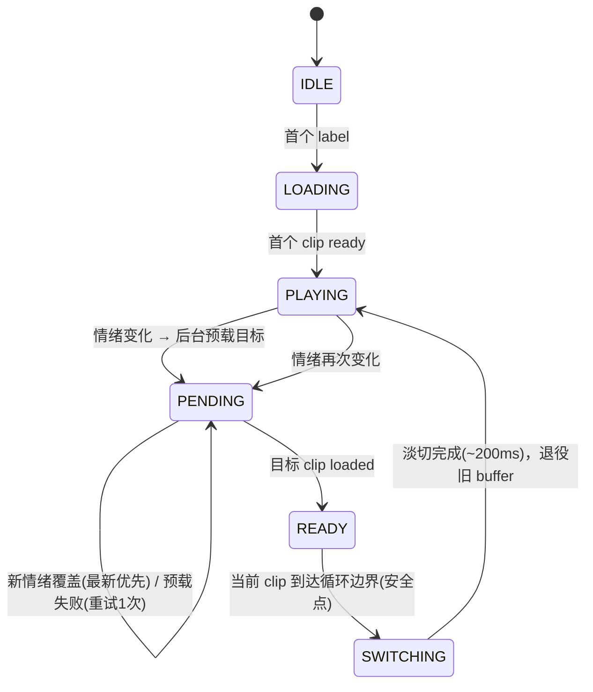

# 14 — Seedance 视频情绪循环系统（虚拟患者 mood loop + 无缝切换调度）

> 状态：待评审（暂不实施）。2026-08-02。
> 范围：虚拟患者情绪可视化升级——Seedance 预生成 mood loop 视频，运行时按情绪状态无缝切换。
> 关联：SVG 参数化表情已实现（`PatientFace`，refactor/tools-rework 分支）；立绘已随情绪切换（`portraitUrl`）；四域 context 改造见 `13-context-mechanism-redesign.md`。

---

## 一、动机

教师需求：让护理学生在训练中"感受到患者情绪"。

现有情绪载体（从低到高保真）：情绪文字栏 + 4D 数值条 → 立绘随情绪切换（已有）→ SVG 参数化脸（已实现）→ **视频 mood loop（本方案）**。

全部消费端共享同一契约：`Emotion4DLabel`（后端 `resolve_dominant_state` 的 9 态标签）+ 四维数值。**生产者（4D 情绪状态机）稳定，本方案只新增一个消费端**，零后端改动。

## 二、防素材膨胀四决策（核心）

| # | 决策 | 消除的膨胀 |
|---|------|-----------|
| D1 | **一套通用素材服务所有病例**——视频不显示"这个病人"，只显示"这个情绪"；身份由既有立绘+姓名承载 | 13 病例 × 9 情绪 → 9 |
| D2 | **感知聚类：9 标签 → 5 情绪原型**——观众区分不了同类焦虑标签 | 9 → 5 |
| D3 | **每原型 2 变体，会话内轮换**——循环感靠不可预测解决，不靠加状态 | 5 → 10 clips 封顶 |
| D4 | **新增维度（说话/坐姿/场景）= 独立立项**，v1 矩阵不扩维 | 防止 ×2×2×2 递归膨胀 |

**素材总量：10 clips（5 原型 × 2 变体），约 30-60MB，一次批产，全项目共用。**

## 三、9 → 5 感知聚类映射（纯函数）

| 情绪原型 | 覆盖的 4D 标签 | 生成提示词方向 |
|---|---|---|
| `warm` | open_trusting, relaxed | 放松、微笑、眼神温和 |
| `anxious` | trusting_anxious, anxious_cooperative, anxious_guarded | 不安、频繁扫视、手部小动作 |
| `tense` | irritated, defensive | 皱眉、抿嘴、身体绷紧 |
| `withdrawn` | withdrawn | 低头、回避视线、缓慢 |
| `neutral` | neutral | 平静、正常呼吸 |

## 四、循环感抑制（三层）

1. **素材层**：10s clip（Seedance 上限）+ 提示词强制"呼吸/睫毛微动/光影缓变、首尾帧姿态一致"——微动让接缝活起来，边界干净。
2. **变体层**：同情绪连续出现时轮换变体（A→B→A），观众无法预判下一秒画面。
3. **调度层**：切换永远发生在当前 clip 循环边界（自然节拍点）+ 最小驻留——视觉上"等到了该换的时刻"，不是"突然跳变"。

诚实声明：10s 循环本质是循环，目标是"感觉不像"。三层叠加在原型期够用；若仍嫌假，走 D4 立项（长素材/多机位），不渗透 v1 矩阵。

## 五、无缝切换调度（双缓冲 + 安全切换点）



| 规则 | 行为 |
|---|---|
| 安全点 | 当前 clip 的循环边界（`timeupdate` 检测），切在边界 = 视觉无跳变 |
| 最新优先 | PENDING 期间新情绪 → 替换目标，不重复预载（防抖动） |
| 最小驻留 | 距上次切换 < 3s 的新请求 → 挂起为新 PENDING，不打断当前 |
| 等就绪再切 | 边界到了但目标没载完 → 保持当前，等下一个边界 |
| 优雅降级 | 预载失败 → 停留当前 + 告警日志，不黑屏 |

**架构分离**（延续纪律）：`switchScheduler.ts` 纯状态机 reducer（事件 EMOTION/PRELOADED/BOUNDARY/ERROR，命令 PRELOAD/SWITCH_AT_BOUNDARY/FADE，无 DOM 可单测）；`PatientVideoPlayer.tsx` 双 `<video>` buffer 哑执行器。

## 六、流播放决策

- 渐进式 `<video src>` + HTTP Range 请求（nginx/vite 原生支持），**不用 HLS**——5-10s mood loop 上 HLS 是负资产（分段封装/延迟/muxer 管线）。
- 静音 autoplay（浏览器策略 + 音频归 TTS）；页面隐藏时 pause 省带宽。
- 多码率分级（720p/480p）列为二期。

## 七、资产管理

- `frontend/public/patient-video/manifest.json`（随代码版本化，回滚即回滚素材）：

```jsonc
{
  "version": 1,
  "default": {
    "warm": { "variants": ["warm-a", "warm-b"], "duration": 10.0 },
    "anxious": { "variants": ["anxious-a", "anxious-b"], "duration": 10.0 }
    // …tense / withdrawn / neutral 同构
  },
  "clips": {
    "warm-a": { "src": "/patient-video/warm-a.mp4", "source": "seedance", "job_id": "seed-xxx", "prompt": "…首尾帧姿态一致…", "generated_at": "2026-08-02" }
    // …溯源字段：坏帧/画风漂移时可复现、可重生成
  },
  "cases": {}   // 按病例覆盖槽，v1 留空
}
```

- 架构留 `cases.<id>` 覆盖槽但 v1 留空（教师明确点名某病例要定制时只加 1 条 override，不加矩阵）。
- 回退链：video 缺 label → 立绘（portraitUrl）→ SVG 脸（PatientFace）→ 情绪栏。

## 八、节奏规格

| 参数 | 值 | 理由 |
|---|---|---|
| 切换触发 | 仅情绪状态机事件（轮次粒度） | 节奏 = 对话节拍，不搞定时器 |
| 最小驻留 | 3s | 防快速对话波动闪烁 |
| 安全点 | 当前 clip 循环边界 | 自然转换点，非硬切 |
| 最坏延迟 | ≤ 1 loop（10s），预载兜底通常 1-3s | 感知为"等转换点"，非卡顿 |
| 说话态 | 视频不动，音频归 TTS | 砍掉 ×2 维度（D4） |

## 九、构建顺序（若实施）

1. `emotionToArchetype.ts` — 9→5 映射纯函数 + 单测（未知标签回退 neutral）
2. `switchScheduler.ts` — 纯状态机 reducer（含变体轮换/min-hold/latest-wins/边界等待）+ 全单测，不碰真实视频
3. `PatientVideoPlayer.tsx` — 双 buffer 哑执行器 + 回退链
4. Seedance 批产 10 clips（复用 `backend/infra/volc/auth.py` 火山凭据）→ 填 manifest

## 十、明确不做 / 待定

- 说话态、姿势/场景维度（D4 独立立项）
- HLS / 多码率（二期）
- 中段安全点（`requestVideoFrameCallback` 标注中性帧）——待素材质量评估后决定
- 按病例定制素材（v1 留空）

## 十一、风险与开放问题

- **Seedance 生成质量（首尾帧一致性）决定整个方案观感**——建议先试生成 1 个 clip 评估，再批产 10 个
- 10s loop 的循环感上限——诚实预期，三层抑制是原型期手段
- 素材成本：10 clips 一次批产约 30-60MB；按 D1 全项目共用，边际病例成本为零
- 生成为一次性/周期性运维任务（火山引擎 API 计费），不进入运行时路径
